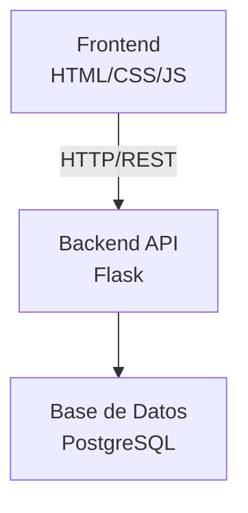

# 🏗️ Arquitectura del Sistema - CimaCritics

# 🏗️ Arquitectura del Sistema - CimaCritics

## 1. Arquitectura General
El sistema sigue una arquitectura cliente-servidor con separación clara entre frontend y backend.

## 2. Componentes del Backend

### 2.1 Capa de Presentación (Routes)
- Endpoints RESTful
- Validación de entrada
- Serialización de respuestas
- Manejo de autenticación

### 2.2 Capa de Lógica de Negocio (Services)
- Reglas de negocio
- Validaciones complejas
- Cálculos (promedios, estadísticas)
- Integración con servicios externos

### 2.3 Capa de Datos (Models)
- Definición de entidades
- Relaciones entre tablas
- Consultas a base de datos
- Migraciones

### 2.4 Capa de Utilidades
- Funciones auxiliares
- Configuraciones
- Logging
- Manejo de errores

## 3. Patrón de Diseño
- **MVC (Model-View-Controller)**: Separación clara de responsabilidades
- **Repository Pattern**: Abstracción del acceso a datos
- **Service Layer**: Lógica de negocio centralizada

## 4. Seguridad
- Autenticación JWT
- Autorización basada en roles
- Validación de entrada
- Sanitización de datos
- Rate limiting

## 5. Escalabilidad
- API stateless
- Base de datos optimizada
- Caché (futuro)
- CDN para assets estáticos

## 6. Tecnologías Específicas
- **Web Framework**: Flask
- **ORM**: SQLAlchemy
- **Base de Datos**: PostgreSQL
- **Autenticación**: PyJWT
- **Validación**: Marshmallow
- **Testing**: pytest
- **Documentación**: Flask-RESTX

## 2. Componentes del Backend

### 2.1 Capa de Presentación (Routes)
- Endpoints RESTful
- Validación de entrada
- Serialización de respuestas
- Manejo de autenticación

### 2.2 Capa de Lógica de Negocio (Services)
- Reglas de negocio
- Validaciones complejas
- Cálculos (promedios, estadísticas)
- Integración con servicios externos

### 2.3 Capa de Datos (Models)
- Definición de entidades
- Relaciones entre tablas
- Consultas a base de datos
- Migraciones

### 2.4 Capa de Utilidades
- Funciones auxiliares
- Configuraciones
- Logging
- Manejo de errores

## 3. Patrón de Diseño
- **MVC (Model-View-Controller)**: Separación clara de responsabilidades
- **Repository Pattern**: Abstracción del acceso a datos
- **Service Layer**: Lógica de negocio centralizada

## 4. Seguridad
- Autenticación JWT
- Autorización basada en roles
- Validación de entrada
- Sanitización de datos
- Rate limiting

## 5. Escalabilidad
- API stateless
- Base de datos optimizada
- Caché (futuro)
- CDN para assets estáticos

## 6. Tecnologías Específicas
- **Web Framework**: Flask
- **ORM**: SQLAlchemy
- **Base de Datos**: PostgreSQL
- **Autenticación**: PyJWT
- **Validación**: Marshmallow
- **Testing**: pytest
- **Documentación**: Flask-RESTX