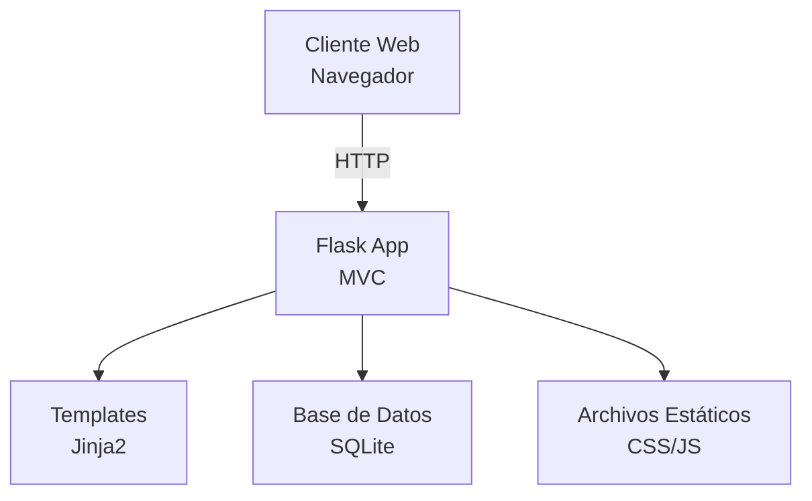

# 🏗️ Arquitectura del Sistema - CimaCritics

## Implementación Actual

El sistema está construido con Flask siguiendo una arquitectura MVC simplificada, con templates del lado servidor y base de datos SQLite para desarrollo.



## 1. Arquitectura General

### Patrón MVC Implementado
- **Model**: SQLAlchemy models en `models/__init__.py`
- **View**: Templates Jinja2 en carpeta `templates/` (futuro)
- **Controller**: Routes en `routes/` (futuro)

### Estructura de Directorios
```
cima_critics/
├── app.py                 # Aplicación principal
├── config.py              # Configuraciones
├── models/                # Modelos SQLAlchemy
├── routes/                # Controladores/Rutas (futuro)
├── templates/             # Vistas HTML (futuro)
├── static/                # Assets CSS/JS (futuro)
├── utils/                 # Utilidades (seeders, helpers)
├── migrations/            # Migraciones Alembic
├── instance/              # Base de datos y configs sensibles
├── docs/                  # Documentación
└── tests/                 # Tests (futuro)
```

## 2. Tecnologías Implementadas

### Backend Framework
- **Flask 3.0.0**: Framework web principal
- **SQLAlchemy 2.0.46**: ORM para base de datos
- **Flask-SQLAlchemy 3.1.1**: Integración Flask-SQLAlchemy
- **Flask-Migrate 4.0.5**: Migraciones de base de datos
- **Flask-Login 0.6.3**: Manejo de sesiones de usuario
- **Flask-WTF 1.2.1**: Formularios con CSRF protection
- **Werkzeug 3.0.1**: Utilidades web (hashing, etc.)

### Base de Datos
- **SQLite**: Base de datos relacional embebida
- **Alembic**: Sistema de migraciones
- Ubicación: `instance/cima_critics.db`

### Entorno de Desarrollo
- **Python 3.12**: Versión del lenguaje
- **Virtualenv**: Entorno virtual aislado
- **python-dotenv**: Carga de variables de entorno
- **pip**: Gestor de paquetes

## 3. Componentes Implementados

### 3.1 Configuración (`config.py`)
```python
class Config:
    SECRET_KEY = os.environ.get('SECRET_KEY') or 'tu_clave_secreta_aqui'
    SQLALCHEMY_DATABASE_URI = os.environ.get('DATABASE_URL') or 'sqlite:///cima_critics.db'
    SQLALCHEMY_TRACK_MODIFICATIONS = False
```

### 3.2 Inicialización de la App (`app.py`)
```python
app = Flask(__name__)
app.config.from_object(Config)

db = SQLAlchemy(app)
migrate = Migrate(app, db)
login = LoginManager(app)
login.login_view = 'login'
```

### 3.3 Modelos de Datos
Seis modelos principales implementados:
- **Usuario**: Autenticación y perfiles
- **Comic**: Información de cómics
- **Review**: Reseñas y calificaciones
- **Seguimiento**: Sistema de seguidores
- **Reporte**: Moderación de contenido
- **Comentario**: Comentarios en reseñas

### 3.4 Sistema de Autenticación
- **Flask-Login**: Sesiones de usuario
- **Werkzeug**: Hashing seguro de contraseñas
- Roles: Usuario normal, Moderador, Administrador

### 3.5 Migraciones de Base de Datos
- **Flask-Migrate**: Gestión de cambios en esquema
- Comandos: `flask db migrate`, `flask db upgrade`
- Historial versionado en `migrations/versions/`

### 3.6 Seeders
- Script `utils/seed.py` para datos iniciales
- 5 usuarios de ejemplo + 5 cómics clásicos + reseñas

## 4. Seguridad Implementada

### Autenticación
- Hashing PBKDF2 para contraseñas
- Sesiones seguras con SECRET_KEY
- Protección CSRF en formularios

### Autorización
- Decoradores `@login_required`
- Verificación de roles (admin/moderador)
- Acceso basado en propiedad de contenido

### Validación
- Longitud de campos en modelos
- Constraints de integridad referencial
- Validación de formularios con WTForms

## 5. Base de Datos

### Esquema Actual
```sql
-- Tablas principales
usuario (id, nombre, email, contraseña_hash, fecha_registro, es_admin, es_moderador, bio, avatar_url, seguidores_count, siguiendo_count)
comic (id, titulo, autor, año, editorial, genero, descripcion, imagen_url, fecha_creacion, promedio_calificacion)
review (id, usuario_id, comic_id, calificacion, texto, fecha_creacion, likes, dislikes)
seguimiento (id, seguidor_id, seguido_id, fecha_seguimiento)
reporte (id, usuario_id, contenido_tipo, contenido_id, motivo, descripcion, fecha_reporte, estado)
comentario (id, review_id, usuario_id, texto, fecha_creacion, likes, dislikes)
```

### Relaciones
- Usuario 1:N Review, Comentario, Reporte
- Comic 1:N Review
- Review 1:N Comentario
- Usuario N:M Seguimiento (auto-referencial)

### Índices
- Email único en usuario
- FKs indexadas automáticamente
- Búsqueda en titulo, autor, genero

## 6. Próximas Extensiones

### Arquitectura Futura
- **API REST**: Endpoints JSON para SPA
- **PostgreSQL**: Base de datos de producción
- **Redis**: Caché y sesiones
- **Celery**: Tareas asíncronas
- **Docker**: Containerización

### Escalabilidad
- **Load Balancer**: Distribución de carga
- **CDN**: Assets estáticos
- **Database Sharding**: Particionamiento horizontal
- **Microservicios**: Separación de concerns

### Monitoreo y Logging
- **Sentry**: Error tracking
- **Prometheus**: Métricas
- **ELK Stack**: Logs centralizados

## 7. Despliegue

### Desarrollo
- `flask run`: Servidor de desarrollo
- `python utils/seed.py`: Poblar DB
- Virtualenv activado

### Producción (Futuro)
- **Gunicorn**: WSGI server
- **Nginx**: Reverse proxy
- **PostgreSQL**: Base de datos
- **Docker Compose**: Orquestación