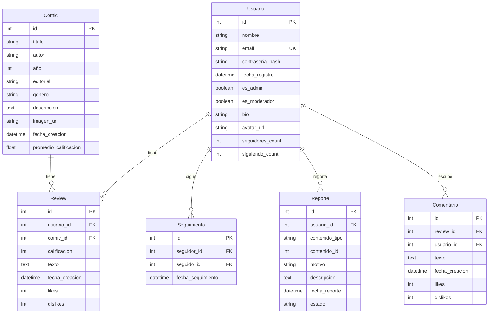

# 📊 Diagrama Entidad-Relación - CimaCritics

# 📊 Diagrama Entidad-Relación - CimaCritics

## Modelo de Datos



## Relaciones

### Usuario - Review
- **Tipo**: 1:N (Un usuario puede tener muchas reseñas)
- **Cardinalidad**: 1..1 → 0..N
- **Restricción**: Usuario debe existir para crear reseña

### Comic - Review
- **Tipo**: 1:N (Un cómic puede tener muchas reseñas)
- **Cardinalidad**: 1..1 → 0..N
- **Restricción**: Cómic debe existir para crear reseña

### Usuario - Seguimiento
- **Tipo**: 1:N (Un usuario puede seguir a muchos, y ser seguido por muchos)
- **Cardinalidad**: 0..N → 0..N

### Usuario - Reporte
- **Tipo**: 1:N (Un usuario puede reportar muchos contenidos)

### Review - Comentario
- **Tipo**: 1:N (Una reseña puede tener muchos comentarios)

## Atributos Derivados
- **Comic.promedio_rating**: Calculado como promedio de Review.calificacion
- **Review.likes/dislikes**: Contadores de votos positivos/negativos
- **Usuario.seguidores_count/siguiendo_count**: Contadores calculados

## Reglas de Integridad
1. Email único por usuario
2. Calificación entre 1-5
3. Usuario no puede reseñar el mismo cómic dos veces
4. Solo administradores pueden modificar ciertos campos

## Índices Recomendados
- Usuario.email (único)
- Comic.titulo, Comic.autor (búsqueda)
- Review.usuario_id, Review.comic_id (joins)
- Comic.genero, Comic.editorial (filtros)

## Implementación SQLAlchemy

### Usuario
```python
class Usuario(UserMixin, db.Model):
    id = db.Column(db.Integer, primary_key=True)
    nombre = db.Column(db.String(64), nullable=False)
    email = db.Column(db.String(120), unique=True, nullable=False)
    contraseña_hash = db.Column(db.String(128), nullable=False)
    fecha_registro = db.Column(db.DateTime, default=datetime.utcnow)
    es_admin = db.Column(db.Boolean, default=False)
    es_moderador = db.Column(db.Boolean, default=False)
    bio = db.Column(db.Text)
    avatar_url = db.Column(db.String(256))
    seguidores_count = db.Column(db.Integer, default=0)
    siguiendo_count = db.Column(db.Integer, default=0)
```

### Comic
```python
class Comic(db.Model):
    id = db.Column(db.Integer, primary_key=True)
    titulo = db.Column(db.String(128), nullable=False)
    autor = db.Column(db.String(64), nullable=False)
    año = db.Column(db.Integer)
    editorial = db.Column(db.String(64))
    genero = db.Column(db.String(32))
    descripcion = db.Column(db.Text)
    imagen_url = db.Column(db.String(256))
    fecha_creacion = db.Column(db.DateTime, default=datetime.utcnow)
    promedio_calificacion = db.Column(db.Float, default=0.0)
```

### Review
```python
class Review(db.Model):
    id = db.Column(db.Integer, primary_key=True)
    usuario_id = db.Column(db.Integer, db.ForeignKey('usuario.id'), nullable=False)
    comic_id = db.Column(db.Integer, db.ForeignKey('comic.id'), nullable=False)
    calificacion = db.Column(db.Integer, nullable=False)  # 1-5
    texto = db.Column(db.Text)
    fecha_creacion = db.Column(db.DateTime, default=datetime.utcnow)
    likes = db.Column(db.Integer, default=0)
    dislikes = db.Column(db.Integer, default=0)
```

### Seguimiento
```python
class Seguimiento(db.Model):
    id = db.Column(db.Integer, primary_key=True)
    seguidor_id = db.Column(db.Integer, db.ForeignKey('usuario.id'), nullable=False)
    seguido_id = db.Column(db.Integer, db.ForeignKey('usuario.id'), nullable=False)
    fecha_seguimiento = db.Column(db.DateTime, default=datetime.utcnow)
```

### Reporte
```python
class Reporte(db.Model):
    id = db.Column(db.Integer, primary_key=True)
    usuario_id = db.Column(db.Integer, db.ForeignKey('usuario.id'), nullable=False)
    contenido_tipo = db.Column(db.String(32), nullable=False)  # 'review', 'comentario'
    contenido_id = db.Column(db.Integer, nullable=False)
    motivo = db.Column(db.String(64), nullable=False)
    descripcion = db.Column(db.Text)
    fecha_reporte = db.Column(db.DateTime, default=datetime.utcnow)
    estado = db.Column(db.String(32), default='pendiente')  # pendiente, resuelto, rechazado
```

### Comentario
```python
class Comentario(db.Model):
    id = db.Column(db.Integer, primary_key=True)
    review_id = db.Column(db.Integer, db.ForeignKey('review.id'), nullable=False)
    usuario_id = db.Column(db.Integer, db.ForeignKey('usuario.id'), nullable=False)
    texto = db.Column(db.Text, nullable=False)
    fecha_creacion = db.Column(db.DateTime, default=datetime.utcnow)
    likes = db.Column(db.Integer, default=0)
    dislikes = db.Column(db.Integer, default=0)
```

## Migraciones Alembic
- Configuradas con Flask-Migrate
- Comando: `flask db migrate` para generar migraciones
- Comando: `flask db upgrade` para aplicar cambios
- Historial en `migrations/versions/`

## Seeders (Datos Iniciales)
- Script: `utils/seed.py`
- Ejecutar: `python utils/seed.py`
- Incluye usuarios de ejemplo, cómics clásicos y reseñas