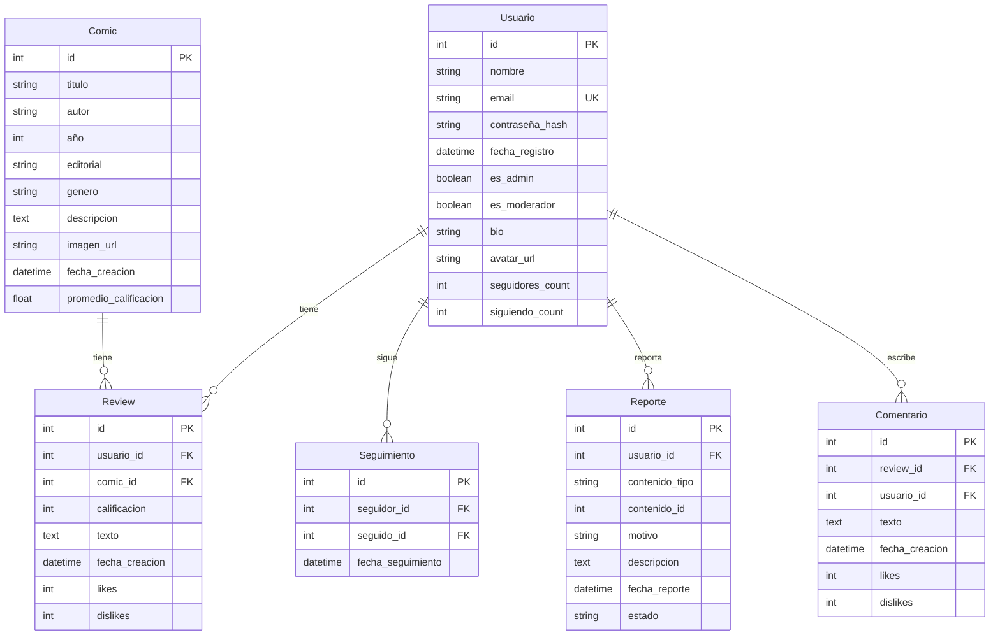

# 📊 Diagrama Entidad-Relación - CimaCritics

# 📊 Diagrama Entidad-Relación - CimaCritics

## Modelo de Datos

## Relaciones

### Usuario - Review
- **Tipo**: 1:N (Un usuario puede tener muchas reseñas)
- **Cardinalidad**: 1..1 → 0..N
- **Restricción**: Usuario debe existir para crear reseña

### Comic - Review
- **Tipo**: 1:N (Un cómic puede tener muchas reseñas)
- **Cardinalidad**: 1..1 → 0..N
- **Restricción**: Cómic debe existir para crear reseña

### Usuario - Seguimiento
- **Tipo**: 1:N (Un usuario puede seguir a muchos, y ser seguido por muchos)
- **Cardinalidad**: 0..N → 0..N

### Usuario - Reporte
- **Tipo**: 1:N (Un usuario puede reportar muchos contenidos)

### Review - Comentario
- **Tipo**: 1:N (Una reseña puede tener muchos comentarios)

## Atributos Derivados
- **Comic.promedio_rating**: Calculado como promedio de Review.calificacion
- **Review.likes/dislikes**: Contadores de votos positivos/negativos
- **Usuario.seguidores_count/siguiendo_count**: Contadores calculados

## Reglas de Integridad
1. Email único por usuario
2. Calificación entre 1-5
3. Usuario no puede reseñar el mismo cómic dos veces
4. Solo administradores pueden modificar ciertos campos

## Índices Recomendados
- Usuario.email (único)
- Comic.titulo, Comic.autor (búsqueda)
- Review.usuario_id, Review.comic_id (joins)
- Comic.genero, Comic.editorial (filtros)

## Relaciones

### Usuario - Review
- **Tipo**: 1:N (Un usuario puede tener muchas reseñas)
- **Cardinalidad**: 1..1 → 0..N
- **Restricción**: Usuario debe existir para crear reseña

### Comic - Review
- **Tipo**: 1:N (Un cómic puede tener muchas reseñas)
- **Cardinalidad**: 1..1 → 0..N
- **Restricción**: Cómic debe existir para crear reseña

## Atributos Derivados
- **Comic.promedio_rating**: Calculado como promedio de Review.calificacion
- **Review.likes/dislikes**: Contadores de votos positivos/negativos

## Reglas de Integridad
1. Email único por usuario
2. Calificación entre 1-5
3. Usuario no puede reseñar el mismo cómic dos veces
4. Solo administradores pueden modificar ciertos campos

## Índices Recomendados
- Usuario.email (único)
- Comic.titulo, Comic.autor (búsqueda)
- Review.usuario_id, Review.comic_id (joins)
- Comic.genero, Comic.editorial (filtros)